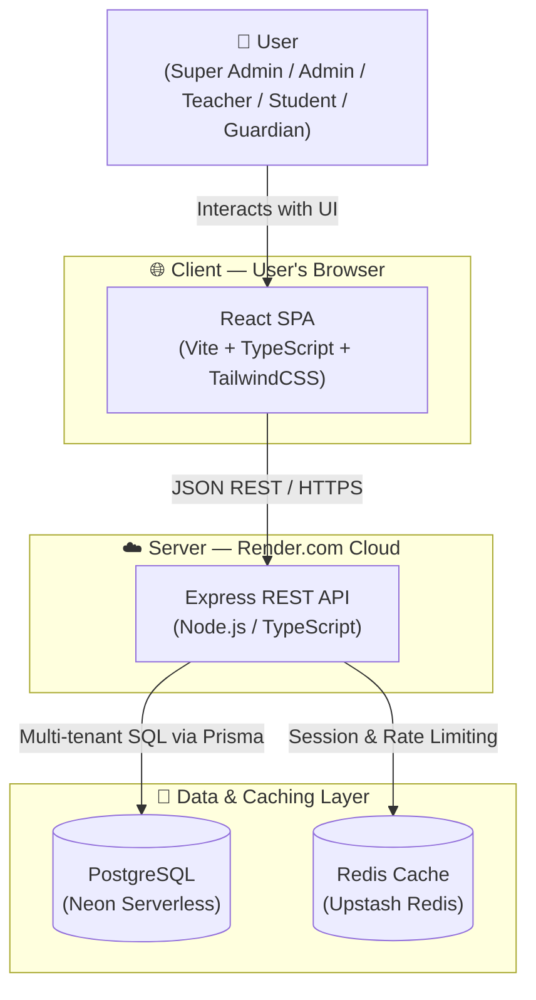
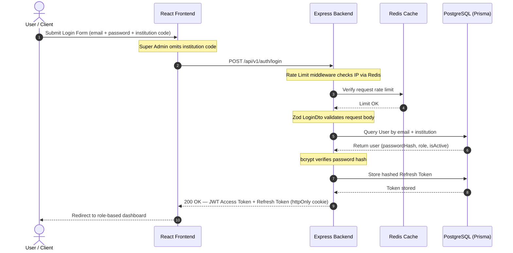
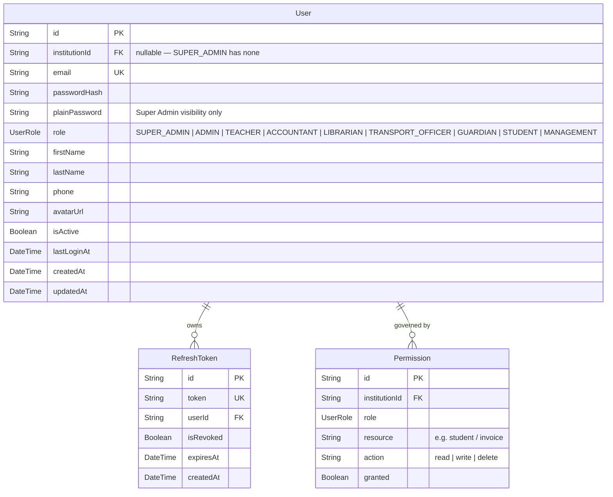
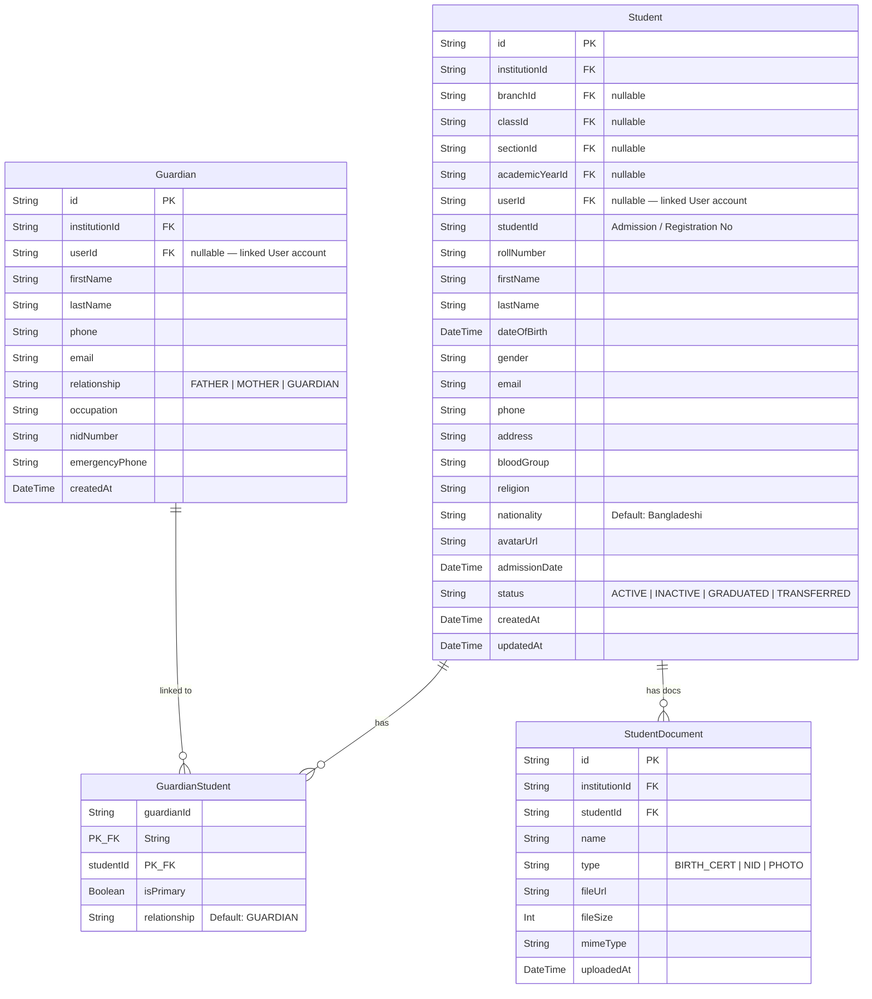
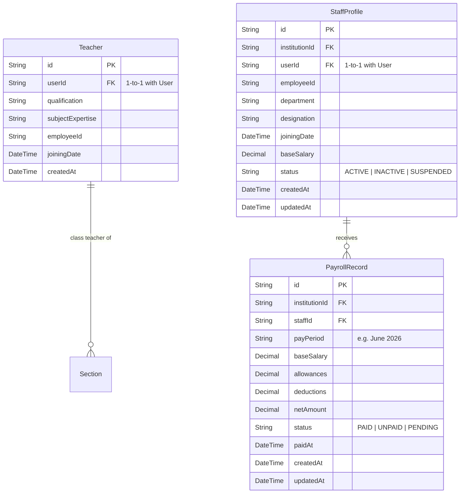
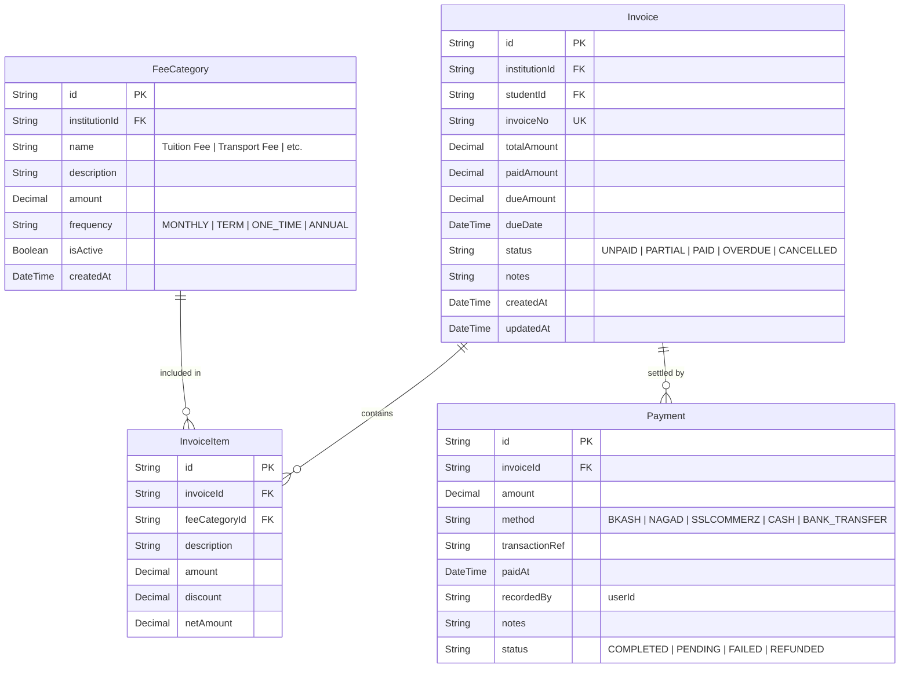
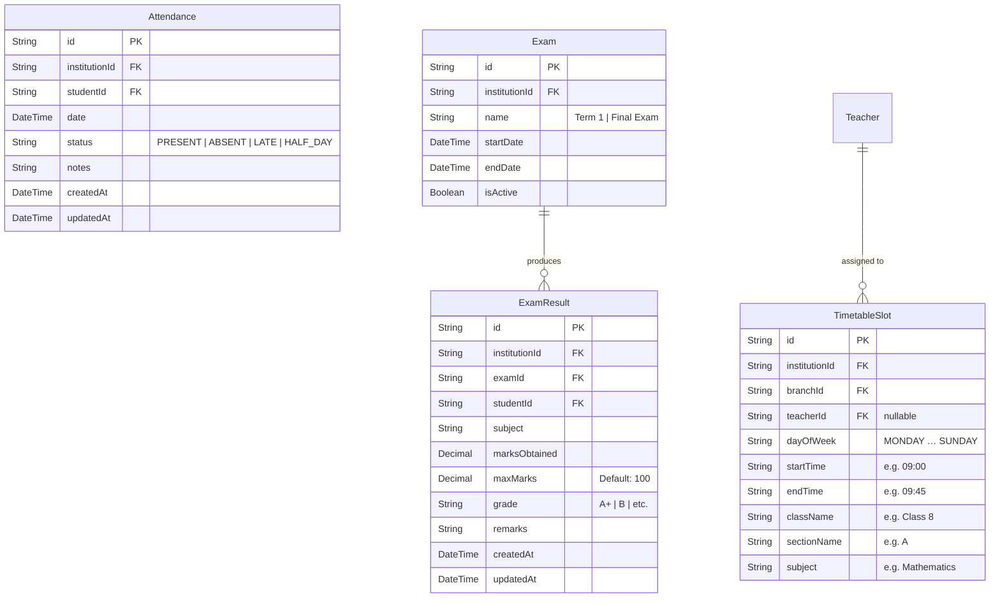
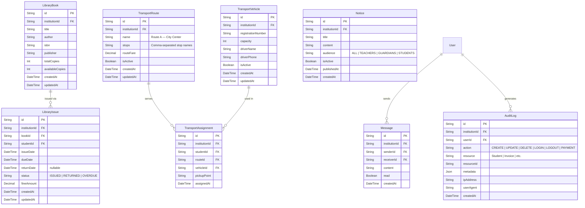
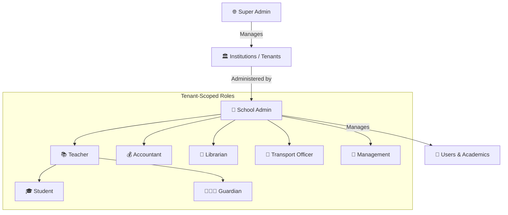
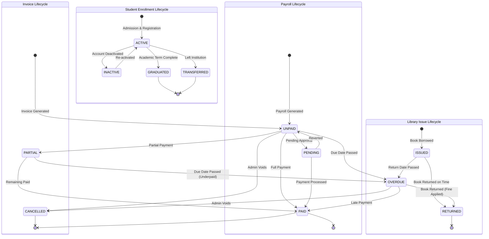

# PeopleIT Student Management System (SMS) 🚀

> **PeopleIT SMS** is a production-grade, multi-tenant SaaS platform built to digitize and streamline every academic, administrative, financial, HR, and communication workflow for educational institutions — from a single school to a nationwide school network.

---

## 📌 Table of Contents
- [System Architecture](#-system-architecture)
- [Entity-Relationship Diagram (Full ERD)](#-entity-relationship-diagram-full-erd)
- [ERD Model Reference](#-erd-model-reference--explanations)
- [Role Permission Matrix](#-role-permission-access-matrix)
- [State Transition Diagrams](#-status--transition-state-diagrams)
- [Technology Stack](#%EF%B8%8F-technology-stack)
- [Codebase Structure](#-codebase-structure)
- [Local Development Setup](#%EF%B8%8F-local-development-setup)
- [Demo Logins](#-demo-logins)
- [API Overview](#-api-overview)
- [Coding Best Practices](#%EF%B8%8F-coding-best-practices)
- [Deployment](#-deploying-to-production)

---

## 🏛️ System Architecture

### C4 Container Diagram
This diagram shows the complete high-level deployment architecture of PeopleIT SMS:



---

### Authentication & Tenant Verification Sequence



---

## 🗄️ Entity-Relationship Diagram (Full ERD)

> This ERD is generated directly from the Prisma schema and covers **all 27 models** in the system. Every table scoped to a tenant includes an `institutionId` foreign key for strict multi-tenant data isolation.

### Part 1 — Core Tenant & Academic Structure

```mermaid
erDiagram
    Institution {
        String  id           PK
        String  name
        String  slug         UK  "EIIN / Tenant code"
        String  logoUrl
        String  address
        String  phone
        String  email
        String  country         "Default: BD"
        Boolean isActive
        String  themeColor
        String  heroTitle
        String  heroSubtitle
        String  aboutText
        String  contactEmail
        String  contactPhone
        DateTime createdAt
        DateTime updatedAt
    }

    Branch {
        String  id            PK
        String  institutionId FK
        String  name
        String  address
        Boolean isActive
        DateTime createdAt
    }

    AcademicYear {
        String   id            PK
        String   institutionId FK
        String   label            "e.g. 2024-2025"
        DateTime startDate
        DateTime endDate
        Boolean  isCurrent
    }

    Class {
        String id       PK
        String branchId FK
        String name        "e.g. Grade 5 / Class 8"
        Int    level
    }

    Section {
        String  id             PK
        String  classId        FK
        String  name              "A, B, C … G"
        String  classTeacherId FK "nullable"
    }

    Institution ||--o{ Branch        : "has campuses"
    Institution ||--o{ AcademicYear  : "defines"
    Branch      ||--o{ Class         : "contains"
    Class       ||--o{ Section       : "split into"
```

---

### Part 2 — User, Role & Auth



---

### Part 3 — Student, Guardian & Documents



---

### Part 4 — Teacher & Staff



---

### Part 5 — Fee, Billing & Payments



---

### Part 6 — Attendance, Exams & Timetable



---

### Part 7 — Library, Transport & Communication



---

### Part 8 — Full Cross-Table Relationship Summary

```mermaid
erDiagram
    Institution ||--o{ Branch              : "has"
    Institution ||--o{ User                : "contains"
    Institution ||--o{ Student             : "enrolls"
    Institution ||--o{ Guardian            : "registers"
    Institution ||--o{ FeeCategory         : "defines"
    Institution ||--o{ Invoice             : "issues"
    Institution ||--o{ Attendance          : "records"
    Institution ||--o{ Exam               : "conducts"
    Institution ||--o{ ExamResult          : "stores"
    Institution ||--o{ TimetableSlot       : "schedules"
    Institution ||--o{ Notice              : "publishes"
    Institution ||--o{ LibraryBook         : "owns"
    Institution ||--o{ LibraryIssue        : "tracks"
    Institution ||--o{ TransportVehicle    : "operates"
    Institution ||--o{ TransportRoute      : "defines"
    Institution ||--o{ TransportAssignment : "manages"
    Institution ||--o{ StaffProfile        : "employs"
    Institution ||--o{ PayrollRecord       : "processes"
    Institution ||--o{ Message             : "hosts"
    Institution ||--o{ AuditLog            : "logs"

    Branch   ||--o{ Class           : "contains"
    Class    ||--o{ Section         : "split into"
    Section  }o--o| Teacher         : "managed by"

    User     ||--o| Student         : "linked to"
    User     ||--o| Teacher         : "linked to"
    User     ||--o| Guardian        : "linked to"
    User     ||--o| StaffProfile    : "linked to"
    User     ||--o{ RefreshToken    : "owns"
    User     ||--o{ AuditLog        : "generates"
    User     ||--o{ Message         : "sends/receives"

    Student  ||--o{ GuardianStudent    : "linked to"
    Guardian ||--o{ GuardianStudent    : "linked to"
    Student  ||--o{ StudentDocument    : "has"
    Student  ||--o{ Attendance         : "logs"
    Student  ||--o{ Invoice            : "billed for"
    Student  ||--o{ ExamResult         : "receives"
    Student  ||--o{ LibraryIssue       : "borrows"
    Student  ||--o{ TransportAssignment: "assigned to"
    Student  }o--o{ AcademicYear       : "enrolled in"

    Invoice  ||--o{ InvoiceItem    : "contains"
    Invoice  ||--o{ Payment        : "settled by"
    FeeCategory ||--o{ InvoiceItem : "referenced by"

    Exam      ||--o{ ExamResult    : "produces"

    LibraryBook      ||--o{ LibraryIssue        : "issued via"
    TransportRoute   ||--o{ TransportAssignment : "used by"
    TransportVehicle ||--o{ TransportAssignment : "assigned in"

    StaffProfile ||--o{ PayrollRecord : "receives"
    Teacher      ||--o{ TimetableSlot : "assigned to"
```

---

## 📋 ERD Model Reference & Explanations

| # | Model | Description |
|---|-------|-------------|
| 1 | **Institution** | The root multi-tenant anchor. Every record in the system belongs to an institution via `institutionId`. Stores branding, contact details, and theme config. |
| 2 | **Branch** | A physical campus or department under an institution. Classes are created at the branch level. |
| 3 | **AcademicYear** | Defines the school year (e.g. 2024–2025). Students can be enrolled in a specific academic year. |
| 4 | **Class** | An academic grade level (e.g. Class 8, Grade 5). Belongs to a Branch. |
| 5 | **Section** | A subdivision of a Class (A through G). Each section can have a dedicated class teacher. |
| 6 | **User** | Central authentication entity. Can be linked to a Student, Teacher, Guardian, or StaffProfile via 1-to-1 relations. Roles: `SUPER_ADMIN`, `ADMIN`, `TEACHER`, `ACCOUNTANT`, `LIBRARIAN`, `TRANSPORT_OFFICER`, `GUARDIAN`, `STUDENT`, `MANAGEMENT`. |
| 7 | **Permission** | Fine-grained RBAC table allowing per-institution, per-role, per-resource access control overrides. |
| 8 | **RefreshToken** | JWT refresh token store with revocation support for secure session management. |
| 9 | **Student** | Full student profile including academic placement (class/section), personal details, and status lifecycle. |
| 10 | **Guardian** | Parent or guardian profile, linked to one or more students via the join table. |
| 11 | **GuardianStudent** | Many-to-many join table linking Guardian → Student. Supports primary guardian designation. |
| 12 | **StudentDocument** | Uploaded files attached to a student (birth certificates, IDs, photos). |
| 13 | **Teacher** | Teacher profile linked 1-to-1 to a User. Holds academic qualifications and subject expertise. |
| 14 | **StaffProfile** | Non-teaching staff profile (Admin, Accountant, etc.). Linked 1-to-1 to a User. Used for payroll. |
| 15 | **PayrollRecord** | Monthly payroll entry per staff member. Tracks salary, allowances, deductions, and payment status. |
| 16 | **FeeCategory** | Defines a type of fee (Tuition, Transport, etc.) with amount and billing frequency. |
| 17 | **Invoice** | A billing statement issued to a student. Tracks total, paid, and due amounts with status lifecycle. |
| 18 | **InvoiceItem** | Line items within an invoice, each linked to a FeeCategory. |
| 19 | **Payment** | A payment record against an invoice. Supports BKash, Nagad, Cash, Bank Transfer, etc. |
| 20 | **Attendance** | Daily attendance record per student. Enforces a unique constraint per `(institution, student, date)`. |
| 21 | **Exam** | An exam event (e.g. Term 1, Final Exam) scoped to an institution with a date range. |
| 22 | **ExamResult** | Subject-level marks entry for a student in a given exam. Calculates grade automatically. |
| 23 | **TimetableSlot** | A weekly schedule slot mapping teacher → subject → class/section → time window. |
| 24 | **Notice** | Institution-wide announcements published to specific audiences (All, Teachers, Students, Guardians). |
| 25 | **LibraryBook** | Book catalogue entry tracking total and available copies. |
| 26 | **LibraryIssue** | A book borrowing record linking a student to a book with due dates, return tracking, and fines. |
| 27 | **TransportVehicle** | A school vehicle with driver details and capacity. |
| 28 | **TransportRoute** | A named transport route with stops and fare. |
| 29 | **TransportAssignment** | Assigns a student to a route + vehicle with a specific pickup point. |
| 30 | **Message** | Direct messaging between any two users within an institution. |
| 31 | **AuditLog** | Immutable log of all create/update/delete/login actions for compliance and traceability. |

---

## 🛡️ Role Permission Access Matrix



| Resource | Super Admin | Admin | Teacher | Accountant | Librarian | Transport Officer | Student / Guardian |
|:---|:---:|:---:|:---:|:---:|:---:|:---:|:---:|
| **Institutions (Tenants)** | ✅ Full | 👁️ Read | ❌ | ❌ | ❌ | ❌ | ❌ |
| **Branches & Classes** | ✅ Full | ✅ Full | 👁️ Read | 👁️ Read | 👁️ Read | 👁️ Read | 👁️ Read |
| **User Accounts** | ✅ Admin Only | ✅ Full | 👁️ Read | 👁️ Read | ❌ | ❌ | ❌ |
| **Student Profiles** | ❌ | ✅ Full | ✏️ Read/Write | 👁️ Read | 👁️ Read | ❌ | 👁️ Own Only |
| **Guardians** | ❌ | ✅ Full | 👁️ Read | ❌ | ❌ | ❌ | 👁️ Own Only |
| **Attendance Records** | ❌ | ✅ Full | ✏️ Read/Write | 👁️ Read | ❌ | ❌ | 👁️ Own Only |
| **Exam Marks & Grades** | ❌ | ✅ Full | ✏️ Read/Write | ❌ | ❌ | ❌ | 👁️ Own Only |
| **Invoices & Payments** | ❌ | ✅ Full | ❌ | ✏️ Read/Write | ❌ | ❌ | 💳 Pay Own Only |
| **Library** | ❌ | ✅ Full | ❌ | ❌ | ✅ Full | ❌ | 👁️ Own Issues |
| **Transport** | ❌ | ✅ Full | ❌ | ❌ | ❌ | ✅ Full | 👁️ Own Only |
| **HR & Payroll** | ❌ | ✅ Full | ❌ | 👁️ Read | ❌ | ❌ | ❌ |
| **Notices** | ❌ | ✅ Full | ✏️ Read/Write | 👁️ Read | 👁️ Read | 👁️ Read | 👁️ Read |
| **Messages** | ❌ | ✅ Full | ✏️ Own | ✏️ Own | ✏️ Own | ✏️ Own | ✏️ Own |
| **Audit Logs** | ✅ Full | 👁️ Read | ❌ | ❌ | ❌ | ❌ | ❌ |

---

## 🔄 Status & Transition State Diagrams



---

## ⚙️ Technology Stack

| Layer | Technology |
|---|---|
| **Frontend** | React 18 (Vite), TypeScript, TailwindCSS, Zustand, React Query, Recharts |
| **Backend** | Node.js 20, Express.js, TypeScript, Zod (validation), bcryptjs, jsonwebtoken |
| **ORM** | Prisma 5 (PostgreSQL) |
| **Database** | PostgreSQL — hosted on Neon Serverless |
| **Cache / Rate Limiting** | Redis — Upstash Redis |
| **Auth** | JWT Access Token (15min) + Refresh Token (7 day, httpOnly cookie) |
| **File Handling** | Client-side image compression → Base64 → stored in DB as URL |
| **Deployment** | Frontend → Vercel, Backend → Render.com |

---

## 📁 Codebase Structure

### Monorepo Overview
```
SMS/
├── backend/            # Express REST API
├── frontend/           # React SPA dashboard
├── docker-compose.yml  # Local Postgres & Redis
├── .env.example        # Reference environment variables
└── README.md           # This file
```

---

### 📦 Backend Architecture (`/backend`)

We use a **Domain-Driven module architecture** — files are grouped strictly by business domain, not by technical layer.

```
backend/
├── prisma/
│   ├── schema.prisma       # Single source of truth — all 31 models
│   └── seed.ts             # Default institutions, classes, sections & users
├── src/
│   ├── config/             # Env setup, Prisma client, Redis client, logger
│   ├── middleware/         # authenticate, setTenant, validate, requireRole
│   ├── modules/
│   │   ├── auth/           # Login, token rotation, logout
│   │   ├── users/          # User accounts & profile management
│   │   ├── students/       # Student CRUD, class/section meta APIs
│   │   ├── attendance/     # Daily attendance entry & reporting
│   │   ├── results/        # Exam marks, grade sheets, transcripts
│   │   ├── fees/           # Fee categories, invoices, payments
│   │   ├── timetables/     # Weekly schedule management
│   │   ├── library/        # Book catalogue & issue tracking
│   │   ├── transport/      # Vehicles, routes & student assignments
│   │   ├── hr/             # Staff profiles & payroll records
│   │   ├── notices/        # Notice board announcements
│   │   ├── messages/       # Direct in-app messaging
│   │   ├── guardians/      # Guardian profiles & student linkage
│   │   └── ai/             # Risk scoring & dashboard insights
│   ├── utils/              # Response wrappers, AppError, helpers
│   └── app.ts              # Server entry point
```

#### 🛡️ Standard Module File Structure
Each module contains:
1. **`*.dto.ts`** — Zod schemas for input validation (body, query, params)
2. **`*.repository.ts`** — Raw Prisma queries (data access layer only)
3. **`*.service.ts`** — Business logic, permission checks, data mapping
4. **`*.controller.ts`** — HTTP request handlers, calls service layer
5. **`*.routes.ts`** — Express router with middleware chain

---

### 🎨 Frontend Architecture (`/frontend`)

```
frontend/
├── src/
│   ├── api/            # Axios client (client.ts), endpoint helpers
│   ├── components/     # Reusable UI: Sidebar, Modal, Table, Avatar, etc.
│   ├── hooks/          # useAuth, useTenant, useQueryWrapper
│   ├── pages/
│   │   ├── dashboard/  # Executive summary & KPI cards
│   │   ├── students/   # Student list, detail, enrollment form
│   │   ├── users/      # User management (Admin/Teacher/etc.)
│   │   ├── attendance/ # Daily attendance entry & calendar view
│   │   ├── results/    # Marks entry, grade sheet, result download
│   │   ├── fees/       # Invoice generator, payment tracker
│   │   ├── timetables/ # Weekly grid routine editor
│   │   ├── library/    # Book catalogue & issue management
│   │   ├── transport/  # Vehicle & route assignment
│   │   ├── hr/         # Staff profiles & payroll dashboard
│   │   ├── notices/    # Notice board management
│   │   ├── messages/   # In-app direct messaging
│   │   ├── ai/         # AI risk scoring & analytics
│   │   └── Login.tsx   # Multi-role secure login
│   ├── store/          # Zustand: authStore, themeStore
│   ├── App.tsx         # Root component & routing
│   └── main.tsx        # Vite entrypoint
```

---

## ⚙️ Local Development Setup

### Prerequisites
- **Node.js v18+**
- **Docker Desktop** (for local Postgres & Redis)

### 1. Clone & Environment Setup
```bash
git clone https://github.com/RafatAiub/PeopleIT-SMS-student-management-system-.git
cd SMS
cp .env.example .env
# Edit .env: set DATABASE_URL=postgresql://... and REDIS_URL=redis://localhost:6379
```

### 2. Start Local Services (Postgres & Redis)
```bash
docker compose up -d
```

### 3. Backend Setup
```bash
cd backend
npm install

# Run database migrations
npx prisma migrate dev

# Seed with default institutions, classes (KG–Class 10), sections (A–G) & users
npx prisma db seed

# Start Express server in watch mode
npm run dev
# API runs on: http://localhost:3001
```

### 4. Frontend Setup
Open a new terminal:
```bash
cd frontend
npm install

# Start Vite dev server
npm run dev
# UI runs on: http://localhost:5173
```

---

## 👥 Demo Logins

After seeding, the following accounts are available (password: **`admin123`**):

| Role | Email | Institution Code |
|---|---|---|
| **Super Admin** | `admin@peopleit.com` | *(not required)* |
| **School Admin** | `schooladmin@peopleit.com` | `102030` |
| **Teacher** | `teacher@peopleit.com` | `102030` |
| **Student** | `student@peopleit.com` | `102030` |

---

## 🌐 API Overview

### Base URL
- **Production:** `https://peopleitsms.onrender.com/api/v1`
- **Local:** `http://localhost:3001/api/v1`

### Core Endpoint Groups

| Prefix | Description |
|---|---|
| `POST /auth/login` | Authenticate and receive JWT tokens |
| `POST /auth/refresh` | Rotate access token via refresh cookie |
| `GET /students` | List students (tenant-scoped, paginated) |
| `GET /students/meta/classes` | List classes for a tenant (no nested sections) |
| `GET /students/meta/sections?classId=` | List sections A–G for a class (auto-heals missing ones) |
| `GET /users` | List all users in a tenant |
| `GET /attendance` | Query attendance records |
| `POST /attendance` | Submit attendance entries |
| `GET /results/results-list` | List exam results |
| `POST /results/submit` | Submit marks for an exam |
| `GET /fees/categories` | List fee categories |
| `GET /fees/invoices` | List student invoices |
| `POST /fees/invoices/:id/pay` | Record a payment |
| `GET /library/books` | Library catalogue |
| `GET /transport/routes` | Transport routes |
| `GET /hr/payroll` | Payroll records |
| `GET /notices` | Institution notices |
| `GET /messages` | Inbox messages |

> All endpoints (except `/auth`) require a valid `Authorization: Bearer <token>` header.

---

## 🛡️ Coding Best Practices

### 1. Multi-Tenant Isolation
This is a SaaS application. Every record is tied to an `institutionId`.
- **Rule:** Never query tables without including `institutionId` in the `where` clause.
- **Implementation:** The `setTenant` middleware injects `req.tenantId` from the JWT. All repositories must explicitly filter by this value.

### 2. Standardized Response Format
Always use the utilities in `backend/src/utils/response.ts`:
```ts
successResponse(res, data, 'Message', 200)          // Single object
paginatedResponse(res, array, total, page, size)    // Paginated list
// Errors: pass to next(error) — global handler formats them
```

### 3. TypeScript Type Safety
- Write Zod schemas in `*.dto.ts` and infer types with `z.infer<typeof Schema>`.
- **Never use `any` unless absolutely necessary.**
- Run `npx tsc --noEmit` before every PR.

### 4. Self-Healing Data
The sections API (`GET /students/meta/sections?classId=`) automatically detects and creates missing sections (A–G) on the fly. This prevents empty dropdowns for institutions created before the section schema update.

### 5. Image Handling
All user-uploaded images are compressed client-side (max 400×400px, JPEG 70% quality) before being sent as Base64 to the API. This prevents `413 Request Entity Too Large` errors.

---

## 🚢 Deploying to Production

| Service | Platform | Command |
|---|---|---|
| **Frontend** | Vercel | `npm run build` (auto-deployed on push) |
| **Backend** | Render.com | `npm run build && npm start` |
| **Database** | Neon.tech / Supabase | Prisma migrations via `prisma migrate deploy` |
| **Cache** | Upstash Redis | No deployment needed (managed) |

### Environment Variables Required (Backend)
```env
DATABASE_URL=postgresql://...
REDIS_URL=redis://...
JWT_SECRET=your-secret
JWT_REFRESH_SECRET=your-refresh-secret
JWT_EXPIRES_IN=15m
JWT_REFRESH_EXPIRES_IN=7d
PORT=3001
NODE_ENV=production
```
