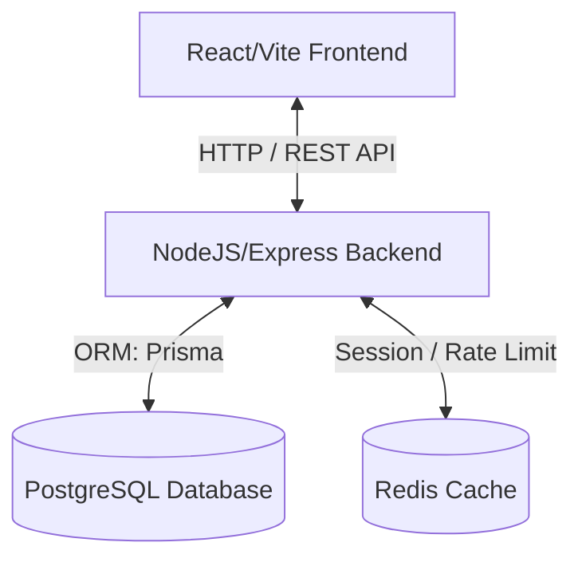

# PeopleIT Student Management System (SMS) 🚀

Welcome to **PeopleIT SMS**! This repository houses a state-of-the-art, multi-tenant Student Management System (SaaS) designed to streamline academic, administrative, and financial workflows for institutions. It features robust role-based access control, advanced scheduling, automated results processing, and built-in AI analytics dashboards.

This document serves as the master guide for any developer joining the project.

---

## 🏛️ System Architecture

PeopleIT SMS is built on a split Client-Server monorepo architecture:



- **Frontend:** React, Vite, TailwindCSS (Vanilla CSS styling inside glassmorphism theme), Zustand (State), React Query (Data Fetching), Axios.
- **Backend:** Node.js, Express, TypeScript, Zod (Request Validation), Winston (Logging).
- **Database:** PostgreSQL managed via Prisma ORM.
- **Caching & Sessions:** Redis (Tokens, Rate-limiting, performance acceleration).

---

## 📁 Codebase Structure

Understanding the layout of this monorepo is key to coding productively.

### Monorepo Overview
```bash
SMS/
├── backend/            # Express API codebase
├── frontend/           # React dashboard UI codebase
├── docker-compose.yml  # Docker environment for local Postgres & Redis
├── .env.example        # Reference environment variables
└── README.md           # You are here
```

---

### 📦 1. Backend Architecture (`/backend`)
We use a modular architecture. Instead of separating files by "controllers" or "routes", we group them strictly by **Business Domain Modules** under `src/modules/`.

```bash
backend/
├── prisma/
│   ├── schema.prisma   # Single source of truth database schema
│   └── seed.ts         # Seed script containing default institution, users, and classes
├── src/
│   ├── config/         # Environment setup, database connections, logger configuration
│   ├── middleware/     # Global middlewares (authenticate, setTenant, validate, requireRole)
│   ├── modules/        # Business Domains
│   │   ├── auth/       # Login, token rotation, logout
│   │   ├── timetables/ # Schedule management with automatic conflict checks
│   │   ├── attendance/ # Student attendance entries
│   │   ├── results/    # Excel uploads, grade sheets, transcript generation
│   │   ├── ai/         # Risk scoring, dashboard insights generator
│   │   └── users/      # Accounts & profile configurations
│   ├── utils/          # Standardized response wrappers, app errors
│   └── app.ts          # Server entry point
```

#### 🛡️ Standard Module Structure
Every module inside `src/modules/` is self-contained and consists of:
1. `*.dto.ts`: Zod schemas validating request body, query params, or URL path parameters.
2. `*.repository.ts`: Direct database interaction via Prisma (Strictly isolates queries).
3. `*.service.ts`: Business logic, permissions, validation checks, and data mapping.
4. `*.controller.ts`: HTTP request/response handler mapping inputs to Services.
5. `*.routes.ts`: Express routes defining endpoint patterns, middlewares, and controllers.

---

### 🎨 2. Frontend Architecture (`/frontend`)
The frontend is a modern SPA designed around a premium dark glassmorphism aesthetic.

```bash
frontend/
├── src/
│   ├── api/            # Axios API client (client.ts) and endpoints mapping (auth.api.ts)
│   ├── components/     # Globally reusable design system units (sidebar, UI components)
│   ├── hooks/          # React hooks managing query mutations and Auth wrapper
│   ├── pages/          # Full page views
│   │   ├── timetables/ # Interactive weekly grid routine
│   │   ├── results/    # Excel smart upload and grading panel
│   │   ├── ai/         # Executive AI insights and student risk analysis
│   │   └── Login.tsx   # Secured multi-role login interface
│   ├── store/          # Zustand authentication & theme configurations (authStore.ts)
│   ├── App.tsx         # Root component & Route management
│   └── main.tsx        # React entrypoint
```

---

## ⚙️ Local Development Setup

To get the project up and running locally, follow these steps:

### 1. Prerequisite Environment
Ensure you have **Node.js (v18+)** and **Docker Desktop** installed.

### 2. Set Up Environment Variables
Copy `.env.example` to `.env` in the project root:
```bash
cp .env.example .env
```
Ensure `DATABASE_URL` is pointing to `localhost:5432` and `REDIS_URL` is pointing to `localhost:6379`.

### 3. Spin Up Local Services (Postgres & Redis)
Use Docker Compose to launch database and cache containers in the background:
```bash
docker compose up -d
```

### 4. Setup Backend
```bash
cd backend
npm install

# Run database migrations
npx prisma migrate dev

# Seed database with mock institutions, classes, and users
npx prisma db seed

# Start Express server in development mode
npm run dev
```

### 5. Setup Frontend
In a new terminal window:
```bash
cd ../frontend
npm install

# Start Vite dev server
npm run dev
```
Open [http://localhost:5173](http://localhost:5173) in your browser.

---

## 👥 Demo Logins
Once seeded, the database contains default accounts with the password **`admin123`**:
- **Super Admin:** `admin@peopleit.com` (Direct login, no institution code needed)
- **School Admin:** `schooladmin@peopleit.com` (EIIN / Institution Code: `102030`)
- **Teacher:** `teacher@peopleit.com` (EIIN: `102030`)
- **Student:** `student@peopleit.com` (EIIN: `102030`)

---

## 🛡️ Coding Best Practices

### 1. Multi-Tenant Isolation
This is a SaaS application. Every record in the database is tied to an `institutionId` (except for Super Admins).
- **Rule:** Never query tables directly without checking tenant isolation. 
- **Implementation:** The `setTenant` middleware automatically extracts the tenant ID from the authenticated user session and injects it into `req.tenantId`. All queries in repositories must explicitly include and filter by `institutionId`.

### 2. Standardized Response Format
Always use the response utilities located in `backend/src/utils/response.ts`.
- **Success:** `successResponse(res, data, 'Message', 200)`
- **Paginated:** `paginatedResponse(res, dataArray, totalCount, page, pageSize, 'Success')`
- **Errors:** Handled automatically by passing the error to Express `next(error)`. The error middleware will format it standardly.

### 3. TypeScript Type Safety
Never use `any` unless absolutely necessary.
- Build Zod schemas inside `*.dto.ts`.
- Infer TypeScript types using `z.infer<typeof Schema>` and export them.
- Always run `npx tsc --noEmit` before opening a pull request to verify no type-check regressions exist.

---

## 🚢 Deploying to Production
For full details, read our Managed Services Deployment Guide.
- **Frontend** compiles using `npm run build` and is deployed to **Vercel**.
- **Backend** compiles using `npm run build` and runs via `npm start` on **Render.com**.
- **Database** is hosted on **Neon.tech** or **Supabase**.
- **Cache** runs on **Upstash Redis**.
