# PeopleIT Student Management System (SMS) 🚀

> **PeopleIT SMS** is a multi-tenant SaaS platform for digitizing academic, administrative, financial, HR, and communication workflows for schools — from a single institution to a nationwide network of them.

**New to this repo?** You don't need to understand everything on this page before you start. Read [🧭 Start Here (For New Contributors)](#-start-here-for-new-contributors) first, get the app running, then come back to the rest as reference.

---

## 📌 Table of Contents
- [Start Here (For New Contributors)](#-start-here-for-new-contributors)
- [Glossary — Key Terms in 60 Seconds](#-glossary--key-terms-in-60-seconds)
- [System Architecture](#-system-architecture)
- [Entity-Relationship Diagram (Full ERD)](#-entity-relationship-diagram-full-erd)
- [ERD Model Reference](#-erd-model-reference--explanations)
- [Role Permission Matrix](#-role-permission-access-matrix)
- [State Transition Diagrams](#-status--transition-state-diagrams)
- [Technology Stack](#%EF%B8%8F-technology-stack)
- [Codebase Structure](#-codebase-structure)
- [Local Development Setup](#%EF%B8%8F-local-development-setup)
- [Environment Variables Reference](#-environment-variables-reference)
- [Demo Logins](#-demo-logins)
- [API Overview](#-api-overview)
- [Coding Rules & Common Pitfalls](#-coding-rules--common-pitfalls)
- [How to Add a New Backend Module](#-how-to-add-a-new-backend-module)
- [Testing & Verification](#-testing--verification)
- [Contributing](#-contributing)
- [Known Limitations & Roadmap](#-known-limitations--roadmap)
- [Deployment](#-deploying-to-production)
- [FAQ](#-faq)

---

## 🧭 Start Here (For New Contributors)

If this is your first day on this codebase, do these in order:

1. **Get it running locally** — follow [Local Development Setup](#%EF%B8%8F-local-development-setup). Budget ~15 minutes.
2. **Log in** with one of the [Demo Logins](#-demo-logins) and click around the app as an Admin, then log out and try as a Teacher and a Student. This teaches you more about the product than any doc.
3. **Read the [Glossary](#-glossary--key-terms-in-60-seconds)** below — five terms (`tenant`, `institution`, `role`, `access token`, `refresh token`) explain 90% of the "why" behind this codebase's structure.
4. **Trace one full request end-to-end.** The best example is the Students module:
   - Frontend: `frontend/src/pages/students/StudentList.tsx` calls the API directly via `apiClient` (see [Coding Rules & Common Pitfalls](#-coding-rules--common-pitfalls) for why it doesn't use the `hooks/useStudents.ts` React Query hooks that also exist in this repo).
   - Backend: `backend/src/modules/students/student.routes.ts` → `student.controller.ts` → `student.service.ts` → `student.repository.ts` → Prisma → PostgreSQL.
   - This exact 5-file chain (`routes → controller → service → repository → Prisma`) repeats for every module. Once you understand it for `students`, you understand it for `fees`, `attendance`, `library`, etc.
5. **Before writing any backend code**, read the multi-tenancy rule in [Coding Rules & Common Pitfalls](#-coding-rules--common-pitfalls). It is the single most important rule in this codebase — getting it wrong leaks one school's data into another school's dashboard.
6. **Before opening a PR**, run `npm run typecheck` from the repo root and see [Testing & Verification](#-testing--verification) — there is currently no automated test suite, so manual verification matters more here than in most projects.

---

## 📖 Glossary — Key Terms in 60 Seconds

| Term | Meaning |
|---|---|
| **Tenant / Institution** | A single school, college, or coaching center using the platform. This is a *multi-tenant* SaaS — one deployment serves many institutions, and their data must never mix. In code, almost every database table has an `institutionId` column, and every request carries a `tenantId` resolved from the logged-in user's JWT. |
| **`req.tenantId`** | Set by the `setTenant` middleware after a user logs in. It's how the backend knows *which school's data* the current request is allowed to touch. It comes from the verified JWT — **never** from the request body or query string (a client could lie about that). |
| **Role** | Every `User` has exactly one `UserRole`: `SUPER_ADMIN`, `ADMIN`, `TEACHER`, `ACCOUNTANT`, `LIBRARIAN`, `TRANSPORT_OFFICER`, `GUARDIAN`, `STUDENT`, or `MANAGEMENT`. `SUPER_ADMIN` is special — it manages institutions themselves and isn't tied to any one `institutionId`. See the [Role Permission Matrix](#-role-permission-access-matrix). |
| **Access Token / Refresh Token** | Login returns a short-lived JWT **access token** (15 min, used on every API call) and a longer-lived **refresh token** (7 days, used only to silently mint a new access token when it expires). See the auth sequence diagram below. |
| **Module** | A self-contained feature area on the backend (`students`, `fees`, `attendance`, ...), always built from the same 5 files: `*.dto.ts`, `*.repository.ts`, `*.service.ts`, `*.controller.ts`, `*.routes.ts`. See [Codebase Structure](#-codebase-structure). |
| **Seed data** | Fake but realistic data (`prisma/seed.ts`, `prisma/seed_demo_data.ts`) loaded into your local database so you have something to click around without manually creating 20 students by hand. |

---

## 🏛️ System Architecture

### C4 Container Diagram
This diagram shows the complete high-level deployment architecture of PeopleIT SMS:

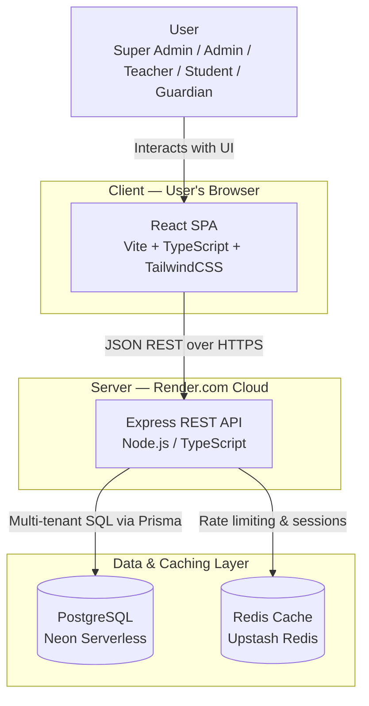

**How to read this:** a user's browser only ever talks to the React app; the React app is the only thing that talks to the API; the API is the only thing that talks to the database and Redis. No component skips a layer.

---

### Authentication & Tenant Verification Sequence

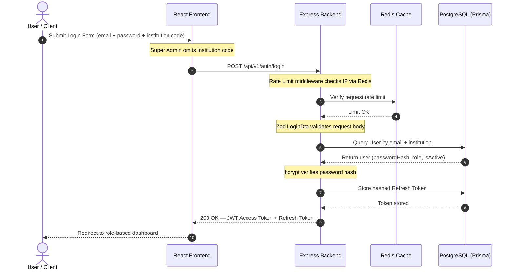

> ⚠️ **Doc vs. reality note:** the frontend currently stores both tokens via Zustand `persist` in `sessionStorage` and sends the refresh token explicitly in the request body on refresh (`frontend/src/api/client.ts`), not as an httpOnly cookie. If you're touching auth code, treat the current implementation (not this diagram's ideal) as the source of truth, and flag this mismatch if you get a chance to fix it — see [Known Limitations](#-known-limitations--roadmap).

---

## 🗄️ Entity-Relationship Diagram (Full ERD)

> The single source of truth is always `backend/prisma/schema.prisma` (**31 models**) — if any diagram below and the schema ever disagree, trust the schema. Every tenant-scoped table has an `institutionId` foreign key.
>
> A single 31-entity, all-fields diagram is unreadable, so this is split into **(1)** a bird's-eye domain map with no fields, then **(2)** six focused diagrams — one per business domain — each showing only the fields that matter for understanding relationships. For the complete field list of every model, see the [ERD Model Reference](#-erd-model-reference--explanations) table below, or just open `schema.prisma` directly.

### 1. Domain Map (bird's-eye view)

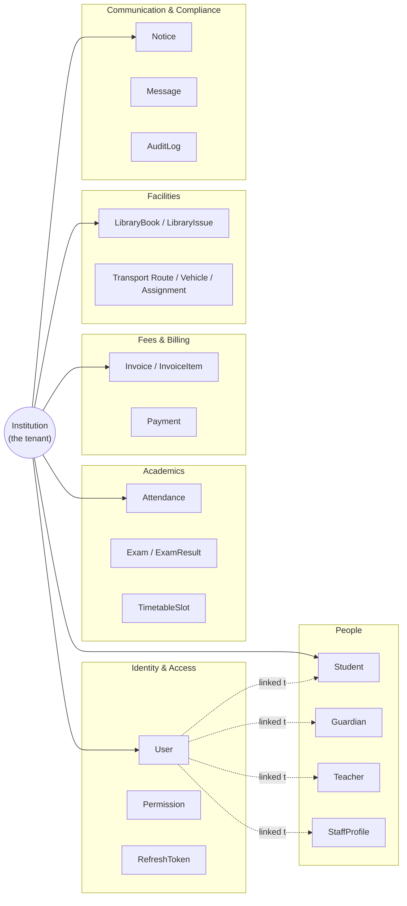

**How to read this:** every solid arrow means "belongs to this tenant." Dotted arrows show that a `User` account can optionally be linked to exactly one Student, Teacher, Guardian, or StaffProfile record — that's how one login system serves every role. The sections below zoom into each domain.

### 2. Tenant & Academic Structure

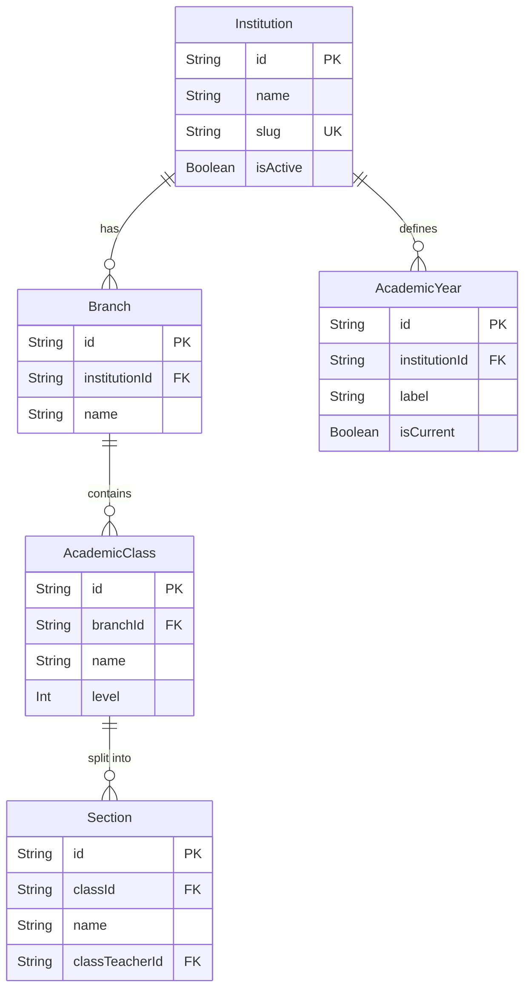

### 3. Identity & Access

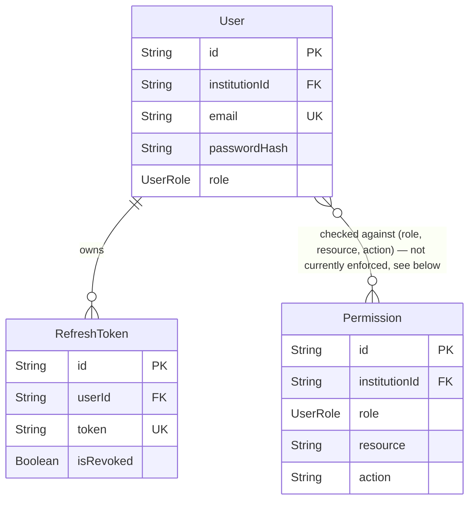

> `Permission` is modeled but **not enforced** anywhere yet — every route currently checks the coarser `role` field directly via `requireRole` middleware instead of this table. See [Known Limitations](#-known-limitations--roadmap).

### 4. Student & Guardian

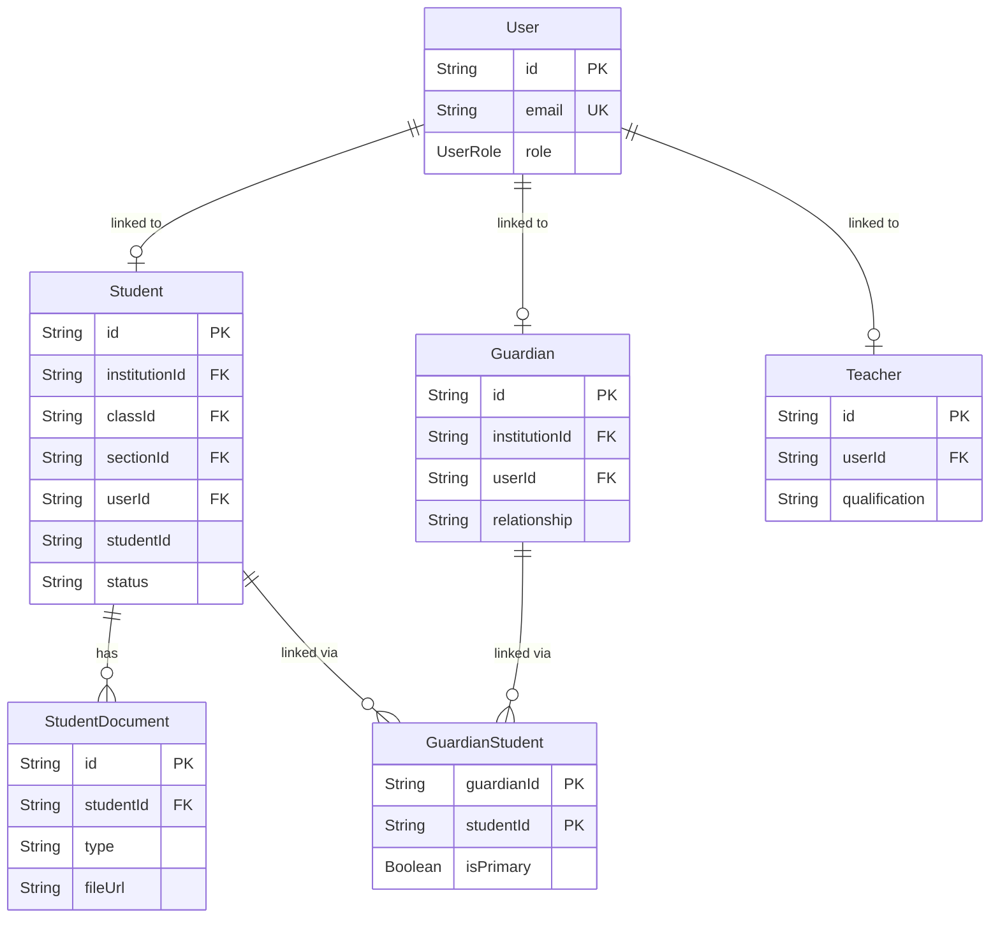

### 5. Fees & Billing

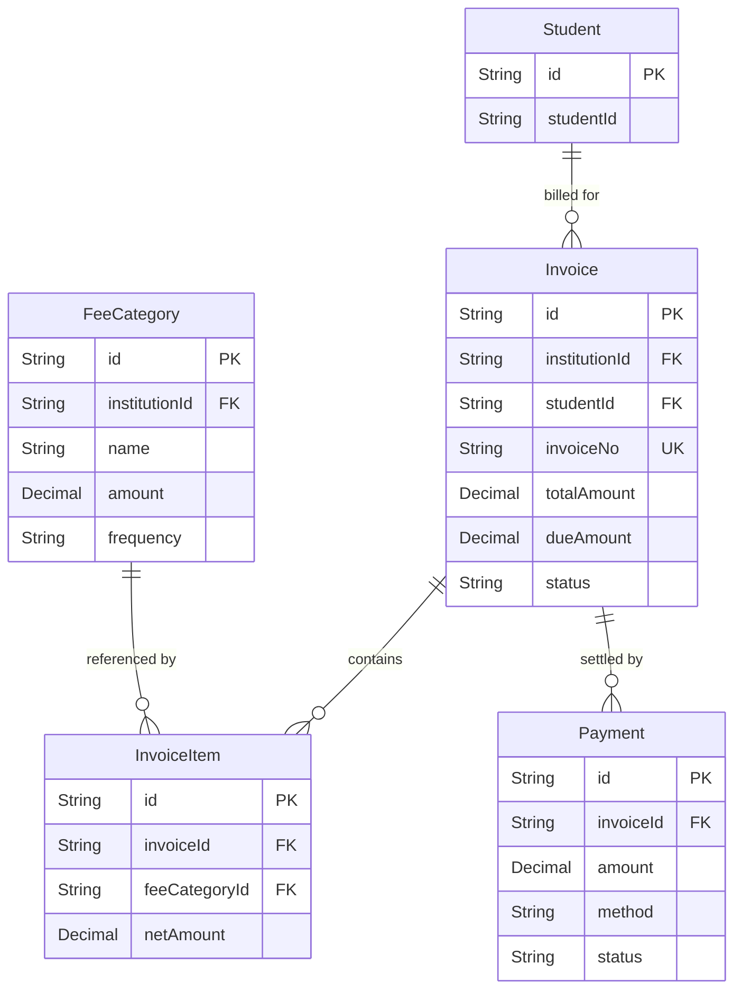

> Invoice status moves `UNPAID → PARTIAL/PAID → OVERDUE/CANCELLED` — see the [state diagram](#-status--transition-state-diagrams) below. Money fields (`totalAmount`, `amount`, ...) are Prisma `Decimal` — see [pitfall #2](#-coding-rules--common-pitfalls) if you're consuming these on the frontend.

### 6. Academics

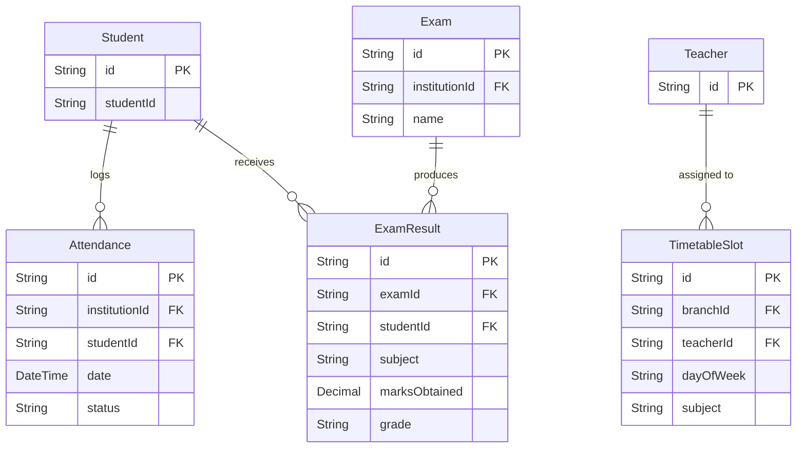

### 7. Facilities, HR & Communication

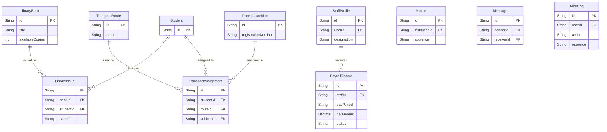

---

## 📋 ERD Model Reference & Explanations

| # | Model | Description |
|---|-------|-------------|
| 1 | **Institution** | The root multi-tenant anchor. Every record in the system belongs to an institution via `institutionId`. Stores branding, contact details, and theme config. |
| 2 | **Branch** | A physical campus or department under an institution. Classes are created at the branch level. |
| 3 | **AcademicYear** | Defines the school year (e.g. 2024–2025). Students can be enrolled in a specific academic year. |
| 4 | **Class** | An academic grade level (e.g. Class 8, Grade 5). Belongs to a Branch. |
| 5 | **Section** | A subdivision of a Class (A through G). Each section can have a dedicated class teacher. |
| 6 | **User** | Central authentication entity. Can be linked to a Student, Teacher, Guardian, or StaffProfile via 1-to-1 relations. Roles: `SUPER_ADMIN`, `ADMIN`, `TEACHER`, `ACCOUNTANT`, `LIBRARIAN`, `TRANSPORT_OFFICER`, `GUARDIAN`, `STUDENT`, `MANAGEMENT`. |
| 7 | **Permission** | Fine-grained RBAC table for per-institution, per-role, per-resource access overrides. **Currently defined but not enforced anywhere** — routes use the coarser `requireRole` middleware instead. See [Known Limitations](#-known-limitations--roadmap). |
| 8 | **RefreshToken** | JWT refresh token store — only a SHA-256 hash is persisted, never the raw token — with revocation support for secure session management. |
| 9 | **Student** | Full student profile including academic placement (class/section), personal details, and status lifecycle. |
| 10 | **Guardian** | Parent or guardian profile, linked to one or more students via the join table. |
| 11 | **GuardianStudent** | Many-to-many join table linking Guardian → Student. Supports primary guardian designation. |
| 12 | **StudentDocument** | Uploaded files attached to a student (birth certificates, IDs, photos). |
| 13 | **Teacher** | Teacher profile linked 1-to-1 to a User. Holds academic qualifications and subject expertise. |
| 14 | **StaffProfile** | Non-teaching staff profile (Admin, Accountant, etc.). Linked 1-to-1 to a User. Used for payroll. |
| 15 | **PayrollRecord** | Monthly payroll entry per staff member. Tracks salary, allowances, deductions, and payment status. |
| 16 | **FeeCategory** | Defines a type of fee (Tuition, Transport, etc.) with amount and billing frequency. |
| 17 | **Invoice** | A billing statement issued to a student. Tracks total, paid, and due amounts with status lifecycle. |
| 18 | **InvoiceItem** | Line items within an invoice, each linked to a FeeCategory. |
| 19 | **Payment** | A payment record against an invoice. Method field supports BKASH/NAGAD/SSLCOMMERZ/CASH/BANK_TRANSFER — note the three online gateways are currently **stub integrations** (see [Known Limitations](#-known-limitations--roadmap)). |
| 20 | **Attendance** | Daily attendance record per student. Enforces a unique constraint per `(institution, student, date)`. |
| 21 | **Exam** | An exam event (e.g. Term 1, Final Exam) scoped to an institution with a date range. |
| 22 | **ExamResult** | Subject-level marks entry for a student in a given exam. |
| 23 | **TimetableSlot** | A weekly schedule slot mapping teacher → subject → class/section → time window. |
| 24 | **Notice** | Institution-wide announcements published to specific audiences (All, Teachers, Students, Guardians). |
| 25 | **LibraryBook** | Book catalogue entry tracking total and available copies. |
| 26 | **LibraryIssue** | A book borrowing record linking a student to a book with due dates, return tracking, and fines. |
| 27 | **TransportVehicle** | A school vehicle with driver details and capacity. |
| 28 | **TransportRoute** | A named transport route with stops and fare. |
| 29 | **TransportAssignment** | Assigns a student to a route + vehicle with a specific pickup point. |
| 30 | **Message** | Direct messaging between any two users within an institution. |
| 31 | **AuditLog** | Log of create/update/delete/login/payment actions for traceability. Written automatically by `auditLog` middleware for normal tenant-scoped routes, and explicitly by service code for pre-tenant Super Admin actions (institution creation, admin credential resets). |

---

## 🛡️ Role Permission Access Matrix

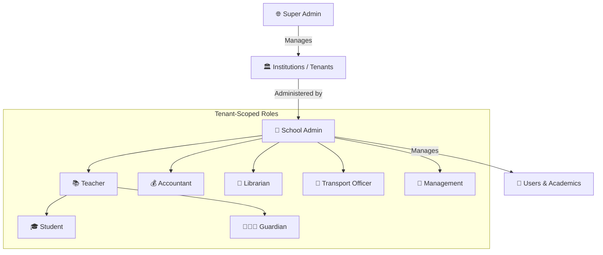

| Resource | Super Admin | Admin | Teacher | Accountant | Librarian | Transport Officer | Student / Guardian |
|:---|:---:|:---:|:---:|:---:|:---:|:---:|:---:|
| **Institutions (Tenants)** | ✅ Full | 👁️ Read | ❌ | ❌ | ❌ | ❌ | ❌ |
| **Branches & Classes** | ✅ Full | ✅ Full | 👁️ Read | 👁️ Read | 👁️ Read | 👁️ Read | 👁️ Read |
| **User Accounts** | ✅ Admin Only | ✅ Full | 👁️ Read | 👁️ Read | ❌ | ❌ | ❌ |
| **Student Profiles** | ❌ | ✅ Full | ✏️ Read/Write | 👁️ Read | 👁️ Read | ❌ | 👁️ Own Only |
| **Guardians** | ❌ | ✅ Full | 👁️ Read | ❌ | ❌ | ❌ | 👁️ Own Only |
| **Attendance Records** | ❌ | ✅ Full | ✏️ Read/Write | 👁️ Read | ❌ | ❌ | 👁️ Own Only |
| **Exam Marks & Grades** | ❌ | ✅ Full | ✏️ Read/Write | ❌ | ❌ | ❌ | 👁️ Own Only |
| **Invoices & Payments** | ❌ | ✅ Full | ❌ | ✏️ Read/Write | ❌ | ❌ | 💳 Pay Own Only |
| **Library** | ❌ | ✅ Full | ❌ | ❌ | ✅ Full | ❌ | 👁️ Own Issues |
| **Transport** | ❌ | ✅ Full | ❌ | ❌ | ❌ | ✅ Full | 👁️ Own Only |
| **HR & Payroll** | ❌ | ✅ Full | ❌ | 👁️ Read | ❌ | ❌ | ❌ |
| **Notices** | ❌ | ✅ Full | ✏️ Read/Write | 👁️ Read | 👁️ Read | 👁️ Read | 👁️ Read |
| **Messages** | ❌ | ✅ Full | ✏️ Own | ✏️ Own | ✏️ Own | ✏️ Own | ✏️ Own |
| **Audit Logs** | ✅ Full | 👁️ Read | ❌ | ❌ | ❌ | ❌ | ❌ |

> This matrix describes the *intended* access model. The frontend's `GUARDIAN` role currently has a minimal, limited UI (Notices + Messages only) — see [Known Limitations](#-known-limitations--roadmap).

---

## 🔄 Status & Transition State Diagrams

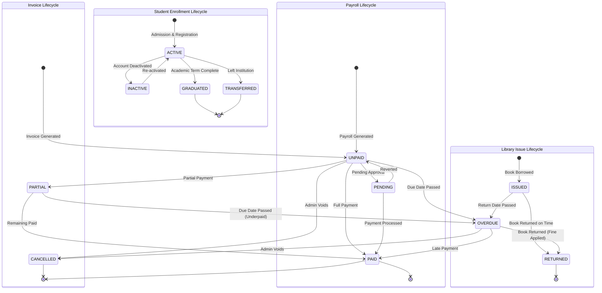

---

## ⚙️ Technology Stack

| Layer | Technology |
|---|---|
| **Frontend** | React 18 (Vite), TypeScript, TailwindCSS, Zustand, TanStack React Query, Recharts, React Hook Form + Zod, react-router-dom |
| **Backend** | Node.js 20, Express.js, TypeScript, Zod (validation), bcryptjs, jsonwebtoken, Winston (logging), Helmet, express-rate-limit |
| **ORM** | Prisma 5 (PostgreSQL) |
| **Database** | PostgreSQL — Neon Serverless in production, plain Postgres via Docker locally |
| **Cache / Rate Limiting** | Redis — Upstash in production, plain Redis via Docker locally |
| **Background Jobs** | BullMQ + ioredis (currently one queue, `feeReminders` — see [Known Limitations](#-known-limitations--roadmap)) |
| **Auth** | JWT Access Token (15 min) + Refresh Token (7 days, rotated on use, hash-only storage) |
| **File Handling** | Client-side image compression → Base64 → stored in DB as a data URL (no object storage yet) |
| **Deployment** | Frontend → Vercel, Backend → Render.com |

---

## 📁 Codebase Structure

### Monorepo Overview
This is an npm **workspaces** monorepo — one `npm install` at the root installs both `backend/` and `frontend/`.

```
SMS/
├── backend/            # Express REST API
├── frontend/           # React SPA dashboard
├── docker-compose.yml  # Local Postgres & Redis
├── .env.example        # Reference environment variables (placeholders only — see below)
└── README.md           # This file
```

---

### 📦 Backend Architecture (`/backend`)

We use a **Domain-Driven module architecture** — files are grouped strictly by business domain, not by technical layer.

```
backend/
├── prisma/
│   ├── schema.prisma       # Single source of truth — all 31 models
│   ├── migrations/         # One folder per migration, applied in order
│   ├── seed.ts             # Minimal seed: 1 institution, 4 demo users, classes/sections
│   └── seed_demo_data.ts   # Richer seed: teachers, guardians, students, invoices, etc. per existing institution
├── src/
│   ├── config/              # env.ts (Zod-validated env), prisma.ts, redis.ts, logger.ts
│   ├── middleware/           # authenticate, setTenant, validate, requireRole, auditLog
│   ├── modules/
│   │   ├── auth/            # Login, token rotation, logout
│   │   ├── users/           # User accounts & profile management
│   │   ├── students/        # Student CRUD, class/section meta APIs
│   │   ├── guardians/       # Guardian profiles & student linkage
│   │   ├── attendance/      # Daily attendance entry & reporting
│   │   ├── results/         # Exam marks, grade sheets
│   │   ├── fees/            # Fee categories, invoices, payments (+ payment gateway stubs)
│   │   ├── timetables/      # Weekly schedule management
│   │   ├── library/         # Book catalogue & issue tracking
│   │   ├── transport/       # Vehicles, routes & student assignments
│   │   ├── hr/               # Staff profiles & payroll records
│   │   ├── notices/         # Notice board announcements
│   │   ├── messages/        # Direct in-app messaging
│   │   ├── reports/         # Cross-module reporting endpoints
│   │   ├── institution/     # Tenant CRUD (Super Admin), public institution list, website config
│   │   └── ai/               # Rule-based risk scoring & dashboard insights (not an LLM — see below)
│   ├── queues/               # BullMQ producers/workers (feeReminders)
│   ├── utils/                 # response.ts, AppError.ts, logger.ts, invoiceNumber.ts
│   └── app.ts / server.ts    # Express app wiring / process entry point
```

#### 🛡️ Standard Module File Structure
Every module (with rare, deliberate exceptions) is built from the same 5 files, and a request always flows through them in this order:

```
routes.ts → controller.ts → service.ts → repository.ts → Prisma → PostgreSQL
```

1. **`*.dto.ts`** — Zod schemas for input validation (body, query, params). `z.infer<typeof Schema>` gives you the matching TypeScript type — write the Zod schema first, don't hand-write a duplicate interface.
2. **`*.repository.ts`** — Raw Prisma queries only. No business logic. Every query on a tenant-scoped model filters by `institutionId`.
3. **`*.service.ts`** — Business logic: existence checks, duplicate checks, permission nuances, orchestrating multiple repository calls, throwing `AppError` subclasses (`NotFoundError`, `ConflictError`, `BadRequestError`, ...).
4. **`*.controller.ts`** — Thin HTTP glue: pull `req.tenantId` / `req.params` / `req.body`, call the service, format the response with `successResponse` / `paginatedResponse`, `catch` → `next(error)`.
5. **`*.routes.ts`** — Express router wiring middleware (`authenticate`, `setTenant`, `validate`, `requireRole`, `auditLog`) in front of each controller method.

---

### 🎨 Frontend Architecture (`/frontend`)

```
frontend/
├── src/
│   ├── api/              # client.ts (axios instance + auth interceptors), auth.api.ts, students.api.ts, fees.api.ts
│   ├── components/
│   │   ├── Charts/        # KpiCard, BarChart, DonutChart, LineChart (Recharts wrappers)
│   │   ├── DataTable/     # Generic table component (not yet used by real pages — see Known Limitations)
│   │   ├── Forms/         # FormField, Select, FileUpload (not yet used by real pages — see Known Limitations)
│   │   ├── Layout/         # Sidebar (role-aware nav)
│   │   └── common/         # ConfirmModal, LoadingSpinner, EmptyState, DashboardSkeleton, StatusBadge
│   ├── hooks/               # useAuth (used), useStudents/useFees (React Query — not yet used), useTableParams (used)
│   ├── pages/
│   │   ├── students/       # StudentList (list + self-service profile view for STUDENT role)
│   │   ├── fees/             # InvoiceList
│   │   ├── attendance/     # AttendanceEntry
│   │   ├── results/         # MarksEntry
│   │   ├── timetables/     # TimetableGrid
│   │   ├── library/          # LibraryManagement
│   │   ├── transport/       # TransportManagement
│   │   ├── hr/                # HrPayrollManagement
│   │   ├── notices/          # NoticeBoard
│   │   ├── communication/  # Messages
│   │   ├── users/             # Users (account management)
│   │   ├── settings/         # Settings
│   │   ├── ai/                 # AiInsights
│   │   ├── reports/          # Reports
│   │   ├── website/          # WebsiteBuilder (public landing-page customizer)
│   │   ├── AdminDashboard.tsx / TeacherDashboard.tsx
│   │   └── Login.tsx
│   ├── store/                  # authStore.ts (user/tokens, sessionStorage), uiStore.ts (theme/sidebar/notifications)
│   ├── App.tsx                # Routing, ProtectedRoute, role-based DashboardRouter
│   └── main.tsx                # Vite entrypoint, QueryClientProvider, BrowserRouter
```

> **A pattern you'll notice:** several well-built pieces exist but aren't wired up yet — `hooks/useStudents.ts`, `hooks/useFees.ts`, `api/students.api.ts`, `api/fees.api.ts`, `components/DataTable/`, `components/Forms/*`. Real pages like `StudentList.tsx` fetch data with `apiClient` directly inside `useState`/`useEffect` instead. **Follow the pattern the page you're editing already uses** rather than mixing both styles in one file. If you want to migrate a page onto the React Query hooks, that's a great, well-scoped contribution — just do it as its own PR.

---

## ⚙️ Local Development Setup

### Prerequisites
- **Node.js v18+** and npm v9+
- **Docker Desktop** (for local Postgres & Redis) — or point `DATABASE_URL`/`REDIS_URL` at your own instances

### 1. Clone & Environment Setup
```bash
git clone https://github.com/RafatAiub/PeopleIT-SMS-student-management-system-.git
cd SMS
cp .env.example .env
```
Now edit `.env` and fill in real values — `.env.example` only contains placeholders, never commit real secrets into it. At minimum you need `DATABASE_URL`, `REDIS_URL`, `JWT_ACCESS_SECRET`, and `JWT_REFRESH_SECRET`. See the [full reference table](#-environment-variables-reference) below.

> ⚠️ If you're running the Postgres/Redis containers from `docker-compose.yml` below, note the **Postgres port mapping is `5433:5432`** — your local `DATABASE_URL` should point at `localhost:5433`, not the default `5432`.

### 2. Start Local Services (Postgres & Redis)
```bash
docker compose up -d
```

### 3. Install Dependencies (root, installs both workspaces)
```bash
npm install
```

### 4. Backend: Migrate, Seed, Run
```bash
cd backend
npx prisma migrate dev      # applies all migrations, generates the Prisma client
npx prisma db seed          # loads prisma/seed.ts — demo institution, classes, sections, 4 users
# optional: richer fake data (teachers, guardians, students, invoices) for the seeded institution
npx ts-node prisma/seed_demo_data.ts

cd ..
npm run dev:backend         # ts-node-dev, watches for changes
# API runs on http://localhost:3001
```

### 5. Frontend: Run
In a second terminal:
```bash
npm run dev:frontend
# UI runs on http://localhost:5173
```

Or start both at once from the repo root:
```bash
npm run dev
```

### 6. Verify It Worked
Open `http://localhost:5173`, log in with one of the [Demo Logins](#-demo-logins), and confirm the dashboard loads with data.

---

## 🔑 Environment Variables Reference

This mirrors `backend/src/config/env.ts`, which validates every variable at startup with Zod and **crashes immediately with a clear error** if something required is missing or malformed — so if the backend won't start, check its console output first.

| Variable | Required? | Default | Notes |
|---|---|---|---|
| `NODE_ENV` | No | `development` | `development` \| `production` \| `test` |
| `PORT` | No | `3001` | |
| `APP_URL` | No | `http://localhost:3001` | |
| `FRONTEND_URL` | No | `http://localhost:5173` | Used for CORS allow-listing |
| `ALLOWED_ORIGINS` | No | — | Comma-separated extra CORS origins (e.g. a Vercel preview URL). No wildcards honored — list exact origins. |
| `DATABASE_URL` | **Yes** | — | PostgreSQL connection string |
| `REDIS_URL` | **Yes** | — | Redis connection string |
| `JWT_ACCESS_SECRET` | **Yes** | — | Min 32 chars. Generate with `node -e "console.log(require('crypto').randomBytes(64).toString('hex'))"` |
| `JWT_REFRESH_SECRET` | **Yes** | — | Same as above, must be a **different** value |
| `JWT_ACCESS_EXPIRES_IN` | No | `15m` | |
| `JWT_REFRESH_EXPIRES_IN` | No | `7d` | |
| `BCRYPT_ROUNDS` | No | `12` | Clamped 10–14 |
| `BKASH_ENABLED` / `NAGAD_ENABLED` / `SSLCOMMERZ_ENABLED` | No | `false` | Gateways are stub implementations regardless — see [Known Limitations](#-known-limitations--roadmap) |
| `SMS_ENABLED`, `TWILIO_*` | No | `false` / unset | SMS sending is not actually implemented yet (the one BullMQ worker just logs) |
| `LOG_LEVEL` / `LOG_FORMAT` | No | `info` / `json` | Winston config |

> **Never commit real values for `DATABASE_URL` or `REDIS_URL` into `.env.example`.** If you ever see real-looking credentials in a tracked file, treat it as a live incident — rotate the credentials immediately and sanitize the file.

---

## 👥 Demo Logins

After running `prisma db seed`, the following accounts are available (password: **`admin123`**):

| Role | Email | Institution Code |
|---|---|---|
| **Super Admin** | `admin@peopleit.com` | *(select "Global Admin" — not required)* |
| **School Admin** | `schooladmin@peopleit.com` | `102030` |
| **Teacher** | `teacher@peopleit.com` | `102030` |
| **Student** | `student@peopleit.com` | `102030` |

If you also ran `seed_demo_data.ts`, additional teacher/guardian/student accounts exist following the pattern `teacher{N}.{institutionSlug}@peopleit.com` etc. — check the script for the full list.

---

## 🌐 API Overview

### Base URL
- **Local:** `http://localhost:3001/api/v1`
- **Production:** depends on your deployment — check your Render service URL, don't assume a hardcoded value.

### Core Endpoint Groups

| Prefix | Description |
|---|---|
| `POST /auth/login` | Authenticate and receive JWT tokens |
| `POST /auth/refresh` | Rotate access token via refresh token |
| `GET /students` | List students (tenant-scoped, paginated) |
| `GET /students/meta/classes` | List classes for a tenant |
| `GET /students/meta/sections?classId=` | List sections A–G for a class (auto-heals missing ones — see gotcha below) |
| `GET /users` | List users in a tenant (paginated — supports `?role=` filter) |
| `GET /attendance` | Query attendance records |
| `POST /attendance/bulk` | Submit attendance entries for a whole section |
| `GET /results/results-list` | List exam results |
| `POST /results/submit` | Submit marks for an exam |
| `GET /fees/categories` | List fee categories |
| `GET /fees/invoices` | List invoices (paginated — supports `?status=` filter) |
| `POST /fees/invoices/:id/pay` | Record a payment |
| `GET /library/books` | Library catalogue |
| `GET /transport/routes` | Transport routes |
| `GET /hr/payroll` | Payroll records |
| `GET /notices` | Institution notices |
| `GET /messages` | Inbox messages |
| `GET /institution/website` / `PUT /institution/website` | Public landing-page config (used by Website Builder) |

> Every endpoint except `/auth/*` and `/institution/public/list` requires `Authorization: Bearer <accessToken>`. Every response — success or error — follows the shape in [Coding Rules & Common Pitfalls](#-coding-rules--common-pitfalls) below.

---

## 🚨 Coding Rules & Common Pitfalls

These aren't style preferences — most of them come directly from real bugs found and fixed in this codebase. Read this before writing backend code.

### 1. Multi-Tenant Isolation — the #1 rule
This is a SaaS application. Every tenant-scoped table has an `institutionId`.
- **Rule:** Never query, update, or delete a tenant-scoped row without `institutionId` in the `where` clause — even if a service-layer check happened earlier. Scope the actual database call, not just the check before it.
- **`req.tenantId` comes from the verified JWT via `setTenant` middleware — never trust an `institutionId` from the request body, query string, or another entity's foreign key without verifying it belongs to the caller's tenant first.**
- Real bug fixed in this codebase: a "list sections for a class" endpoint queried `Section` by a client-supplied `classId` with no ownership check, letting one tenant read (and even auto-seed) another tenant's class data. Always verify the parent entity belongs to `req.tenantId` before trusting a client-supplied foreign key.

### 2. Prisma `Decimal` fields serialize as strings over JSON
Money fields (`Invoice.totalAmount`, `Payment.amount`, etc.) are Prisma `Decimal` — when the API returns them as JSON, they arrive on the frontend as **strings**, not numbers (e.g. `"2500.00"`).
- **Real bug fixed in this codebase:** `totalFees += inv.totalAmount` silently did *string concatenation* instead of addition, producing a KPI card showing `৳025002500`.
- **Rule:** always `Number(value)` a Decimal-sourced field before doing arithmetic on the frontend.

### 3. Paginated list length ≠ total count
List endpoints (`/students`, `/users`, `/fees/invoices`, ...) are paginated and default to a small page size (often 10–20).
- **Real bug fixed in this codebase:** a dashboard summed `.length` of a fetched (paginated) array as "total teachers," which silently undercounted (or showed `0`) once other roles pushed teachers off the first page.
- **Rule:** if you need an accurate count, read `response.meta.total` from a `paginatedResponse` payload — don't fetch one page and count `.length`. If you need to aggregate over *all* rows (e.g. sum every paid invoice), either request a large-enough `pageSize` explicitly or ask for a dedicated aggregate endpoint to be added.

### 4. Standardized Response Format
Always use the utilities in `backend/src/utils/response.ts`:
```ts
successResponse(res, data, 'Message', 200)              // Single object
paginatedResponse(res, array, total, page, pageSize)     // Paginated list — includes `meta.total`
// Errors: throw an AppError subclass in the service layer, catch and pass to next(error) in the controller —
// the global error handler formats the response consistently.
```

### 5. TypeScript Type Safety
- Write Zod schemas in `*.dto.ts` and infer types with `z.infer<typeof Schema>` — don't hand-write a parallel interface that can drift out of sync.
- Avoid `any` where you reasonably can (the codebase isn't 100% strict about this today — don't make it worse).
- **Run `npm run typecheck` from the repo root before every PR.** There is no CI running this for you yet (see [Testing & Verification](#-testing--verification)), so it's on you.

### 6. Self-Healing Data (know this exists, don't copy the pattern)
The sections API (`GET /students/meta/sections?classId=`) auto-creates missing sections (A–G) the first time it's called for a class with none. This is intentional — but it means a plain `GET` request has database write side effects, which is unusual and easy to be surprised by. Don't extend this pattern to new endpoints without a good reason; prefer explicit seed/setup steps instead.

### 7. Image Handling
User-uploaded images are compressed client-side (max 400×400px, JPEG ~70% quality) and sent as a Base64 data URL, stored directly in the DB. There's no object storage (S3/R2) integration yet — keep this in mind before uploading anything large.

---

## 🧩 How to Add a New Backend Module

Say you're adding a `library-fines` module. Copy the shape of an existing simple module (e.g. `guardians` or `notices`) rather than starting from scratch:

1. **`library-fines.dto.ts`** — define Zod schemas for create/update/query bodies.
   ```ts
   export const CreateFineDto = z.object({
     studentId: z.string(),
     amount: z.number().positive(),
     reason: z.string().min(1),
   });
   export type CreateFineDtoType = z.infer<typeof CreateFineDto>;
   ```
2. **`library-fines.repository.ts`** — plain Prisma calls, always scoped by `institutionId`.
3. **`library-fines.service.ts`** — business rules (e.g. "verify the student belongs to this tenant before creating a fine" — see the [tenant isolation rule](#-coding-rules--common-pitfalls)), throwing `NotFoundError`/`ConflictError`/etc. from `utils/AppError.ts`.
4. **`library-fines.controller.ts`** — thin handlers calling the service, using `successResponse`/`paginatedResponse`.
5. **`library-fines.routes.ts`** — wire up `authenticate`, `setTenant`, `validate({...})`, `requireRole(...)`, `auditLog`, then mount the controller methods.
6. **Register the router** in `backend/src/app.ts` (`app.use('/api/v1/library-fines', libraryFinesRouter)`).
7. **Add any new Prisma model** to `schema.prisma`, then run `npx prisma migrate dev --name add_library_fines` to generate the migration — never hand-edit an already-applied migration file.
8. On the frontend, add an `api/library-fines.api.ts` (or just call `apiClient` directly — match whatever pattern the page you're building already uses) and a page under `src/pages/library-fines/`.

---

## ✅ Testing & Verification

**There is currently no automated test suite and no CI pipeline in this repo** (no `test` script, no `.github/workflows`, no Jest/Vitest config). Don't assume tests exist — verify manually:

1. `npm run typecheck` from the repo root (runs both backend and frontend `tsc --noEmit`).
2. Start the app (`npm run dev`) and manually exercise the flow you changed, ideally as more than one role (an Admin action often has different consequences for a Student/Guardian view).
3. If you touched multi-tenant logic, verify with **two different institutions** — log in as Institution A, confirm you can't see or affect Institution B's data.
4. `npm run lint` scripts exist in `package.json` but **no ESLint config file currently exists in this repo** — expect this to fail until one is added. Don't spend time debugging it as if it's your fault.

If you're adding meaningful new logic, adding real tests (Jest/Vitest + Supertest for the API is a reasonable choice) is a welcome and high-value contribution.

---

## 🤝 Contributing

1. **Branch naming:** `feature/short-description`, `fix/short-description`, or `chore/short-description`.
2. **Before you start:** if your change is more than a few lines, open an issue or say what you're about to do — this avoids duplicate work.
3. **Before opening a PR:**
   - `npm run typecheck` passes.
   - You manually verified the change (see [Testing & Verification](#-testing--verification)).
   - If you touched a Prisma model, the migration is included and named descriptively.
   - If you touched anything tenant-scoped, you double-checked the [multi-tenant isolation rule](#-coding-rules--common-pitfalls).
4. **Commit messages:** describe the *why*, not just the *what* — "fix invoice total using string concatenation instead of addition" beats "fix bug."
5. **PR description:** what changed, why, and how you tested it. Screenshots/GIFs are appreciated for UI changes.
6. **Secrets:** never commit real credentials anywhere, including `.env.example`. If you accidentally do, treat it as urgent — rotate immediately, don't just delete the line in a follow-up commit (git history keeps it).

---

## ⚠️ Known Limitations & Roadmap

Being upfront about these saves you from re-discovering them the hard way:

- **No automated tests or CI.** See [Testing & Verification](#-testing--verification).
- **No ESLint config**, despite `lint` scripts existing in `package.json`.
- **AI module is rule-based, not an LLM.** `backend/src/modules/ai/ai.service.ts` uses fixed thresholds and string templates — there's no OpenAI/Anthropic/etc. SDK dependency anywhere in the repo. The `.antigravity/skills/ai-predictive-analytics.md` doc describes a fuller LLM-integration design that hasn't been built yet.
- **Payment gateways are stubs.** `bkash.stub.ts`, `nagad.stub.ts`, `sslcommerz.stub.ts` don't call real payment provider APIs. Wiring up a real gateway is a substantial, valuable contribution.
- **The `feeReminders` BullMQ worker is a no-op.** It logs a "mock notification" instead of sending real SMS/email, even though Twilio env vars are defined.
- **`Permission` table / `requirePermission` middleware is unused.** Fine-grained RBAC is modeled in the schema but every route currently uses the coarser `requireRole` check instead.
- **Frontend has two parallel data-fetching patterns.** React Query hooks (`useStudents`, `useFees`) and typed API modules exist but aren't used by the real pages, which fetch via `apiClient` + `useState`/`useEffect` directly. Pick whichever pattern the file you're editing already uses; don't mix both in one file.
- **`GUARDIAN` role has a minimal frontend.** No guardian-specific dashboard exists yet — guardians land on the Notices page after login.
- **Auth token storage doesn't fully match the "httpOnly cookie" design implied by the architecture diagram** — see the note under [Authentication & Tenant Verification Sequence](#authentication--tenant-verification-sequence).
- **No object storage integration.** Uploaded images are Base64-encoded directly into the database.

If you want a well-scoped first contribution, picking off any one of these (with tests, if you're up for adding the first ones in the repo) is genuinely useful.

---

## 🚢 Deploying to Production

| Service | Platform | Command |
|---|---|---|
| **Frontend** | Vercel | `npm run build` (auto-deployed on push, per `frontend/vercel.json`) |
| **Backend** | Render.com | `npm run build && npm start` |
| **Database** | Neon.tech (or any managed Postgres) | `npx prisma migrate deploy` — do **not** use `migrate dev` in production |
| **Cache** | Upstash Redis (or any managed Redis) | No deployment needed (managed) |

After any change to `schema.prisma`, remember to run `npx prisma migrate deploy` (and `npx prisma generate`) against the production database — pushing code alone does **not** apply pending migrations.

See [Environment Variables Reference](#-environment-variables-reference) for the full list of variables the backend needs in production. At minimum: `DATABASE_URL`, `REDIS_URL`, `JWT_ACCESS_SECRET`, `JWT_REFRESH_SECRET`, `NODE_ENV=production`.

---

## ❓ FAQ

**Q: The dashboard shows a weird number like `৳025002500` instead of a real amount.**
A: That was a real bug (see [pitfall #2](#-coding-rules--common-pitfalls)) — Prisma `Decimal` fields arrive as strings over JSON, and `+=` on strings concatenates instead of adding. Always `Number()` a money field before summing it.

**Q: `npm run lint` fails immediately, did I break something?**
A: No — there's currently no ESLint config in this repo at all. See [Known Limitations](#-known-limitations--roadmap).

**Q: I created 15 teachers but the dashboard still says 0.**
A: Check whether the code reads `array.length` from a paginated fetch instead of `response.meta.total` — see [pitfall #3](#-coding-rules--common-pitfalls).

**Q: Can a Super Admin see student data?**
A: No by design — Super Admin manages institutions themselves (creating them, resetting admin credentials) but has no `institutionId`, so tenant-scoped data like students, attendance, and invoices is intentionally out of reach. Only a school's own `ADMIN` (or roles below it) can see that school's data.

**Q: Where do I ask questions if I'm stuck?**
A: Open an issue on the GitHub repo describing what you tried and what happened — include the exact error message and which demo login/role you were testing with.
